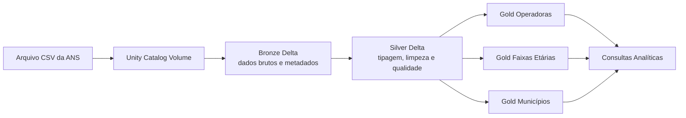

# Healthcare Data Lakehouse

Pipeline de dados em arquitetura **Medallion** desenvolvido com **Databricks SQL**, **Delta Lake** e **Unity Catalog** para análise de informações consolidadas de beneficiários de planos de saúde.

## Objetivo

A solução ingere um arquivo público da Agência Nacional de Saúde Suplementar (ANS), organiza os dados nas camadas Bronze, Silver e Gold e responde às seguintes perguntas:

1. Quais são as cinco operadoras com maior número de beneficiários ativos?
2. Qual é a faixa etária com mais beneficiários e quantos são?
3. Qual é a quantidade de beneficiários por município, em ordem decrescente?

## Observação sobre a fonte

O enunciado menciona dados do estado de São Paulo, porém o arquivo disponibilizado corresponde ao estado do Tocantins (`SG_UF = 'TO'`). A implementação utiliza exatamente o arquivo oficial fornecido:

```text
pda-024-icb-TO-2025_08.csv
```

## Arquitetura



Mais detalhes em [`docs/architecture.md`](docs/architecture.md).

## Tecnologias

- Databricks Free Edition;
- Databricks SQL;
- Delta Lake;
- Unity Catalog;
- SQL;
- Git e GitHub.

## Estrutura do projeto

```text
healthcare-data-lakehouse/
├── notebooks/
│   ├── 00_setup_environment.sql
│   ├── 01_bronze_layer.sql
│   ├── 02_silver_layer.sql
│   ├── 03_gold_layer.sql
│   ├── 04_analytical_queries.sql
│   └── 05_validation_queries.sql
├── sql/
│   ├── bronze/
│   ├── silver/
│   ├── gold/
│   └── analytics/
├── docs/
│   ├── architecture.md
│   └── images/
├── evidence/
│   ├── bronze/
│   ├── silver/
│   ├── gold/
│   └── queries/
├── data/
│   └── README.md
├── .gitignore
├── LICENSE
└── README.md
```

## Camadas

### Bronze

Preserva o conteúdo original do CSV e acrescenta metadados técnicos:

- `_source_file`;
- `_ingestion_timestamp`;
- `_batch_id`.

### Silver

Aplica:

- renomeação das colunas para `snake_case`;
- tipagem de datas e métricas;
- remoção de espaços;
- padronização de campos textuais;
- validação de valores não negativos;
- deduplicação exata;
- criação de chave técnica por hash;
- separação de registros válidos e inválidos.

### Gold

Cria três agregações:

- `gold_operadora_beneficiarios`;
- `gold_faixa_etaria_beneficiarios`;
- `gold_municipio_beneficiarios`.

## Como executar no Databricks

1. Importe a pasta `notebooks/` para o Workspace.
2. Execute `00_setup_environment.sql`.
3. Envie o CSV para o Volume exibido pelo notebook:
   ```text
   /Volumes/<catalogo_atual>/healthcare_landing/source/
   ```
4. Execute os notebooks de `01` a `05` na ordem.
5. Salve evidências das tabelas e consultas na pasta `evidence/`.

## Ordem de execução

| Ordem | Notebook | Responsabilidade |
|---:|---|---|
| 00 | `00_setup_environment.sql` | Criação dos schemas e Volume |
| 01 | `01_bronze_layer.sql` | Ingestão do CSV como tabela Delta Bronze |
| 02 | `02_silver_layer.sql` | Limpeza, tipagem, deduplicação e qualidade |
| 03 | `03_gold_layer.sql` | Criação das agregações Gold |
| 04 | `04_analytical_queries.sql` | Respostas às três perguntas do desafio |
| 05 | `05_validation_queries.sql` | Validações de volumetria e qualidade |

## Decisões de performance

- Delta Lake como formato persistente;
- Gold pré-agregada para evitar repetição de cálculos;
- `OPTIMIZE` opcional, condicionado ao suporte do ambiente e ao volume;
- não foi aplicado particionamento físico ao arquivo mensal inicial, pois o volume é pequeno;
- em cenário histórico, as tabelas seriam avaliadas para particionamento ou clustering por `competencia`.

## Limitações e evolução

Esta primeira versão atende ao escopo do desafio. Evoluções futuras possíveis:

- ingestão mensal incremental;
- `MERGE` por competência e chave técnica;
- testes automatizados;
- Databricks Workflows;
- CI/CD;
- observabilidade e alertas;
- histórico de múltiplas competências;
- catálogo e políticas de acesso mais granulares.

## Autor

**Anderson de Alencar Pereira**  
Senior Data Engineer | Analytics Engineering | Business Intelligence
